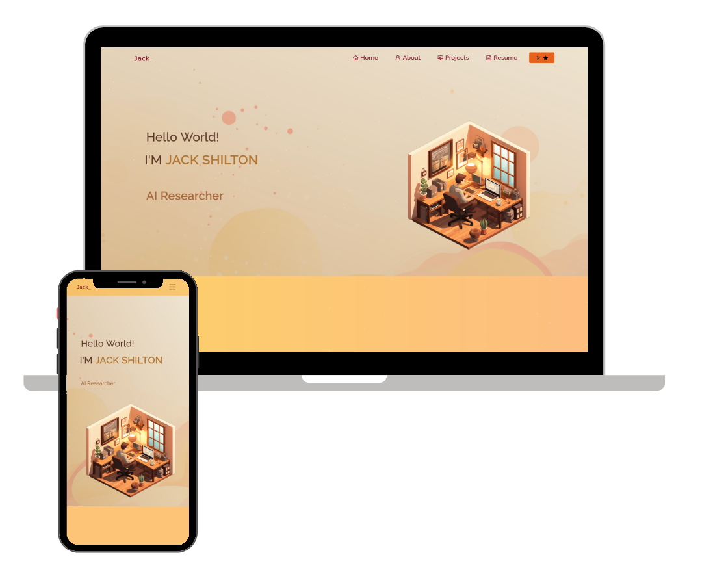

<h2 align="center">
  Portfolio Website 
  <a href="https://jack-development.github.io" target="_blank">Jack-Development.github.io</a>
</h2>

  

## Overview 📝

Welcome to my personal portfolio project! This website showcases some of my GitHub projects, my resume, and my technical skills. You can visit the live version here: [Jack-Development.github.io](https://www.jack-development.github.io/).

## Development 💻

This project was developed with love using the following tools:

<code></code>
<code></code>
<code></code>
<code></code>
<code></code>

## Features 🎮

- Multi-page layout
- Showcases my skills, projects, and experiences
- Easy to add new projects to the site
- Fully Responsive
- GitHub Pages support

## Setup Instructions ⚙️

1. Installation: `npm install`

2. In the project directory, you can run: `npm start`

3. In the project directory, you can run: `npm run deploy` to publish to GitHub pages

`npm start` runs the app in the development mode.\
Open [http://localhost:3000](http://localhost:3000) to view it in the browser.
The page will reload if you make edits.

## Support the Original Template 💕

If you love the template, please show support to the original creator:

